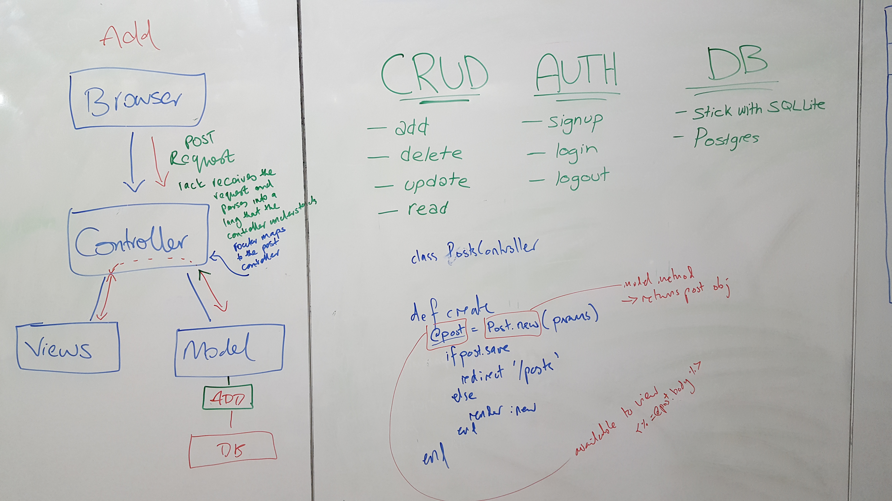
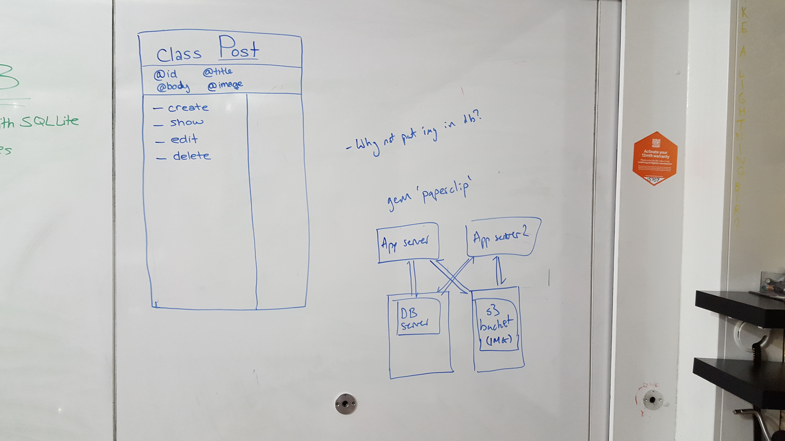
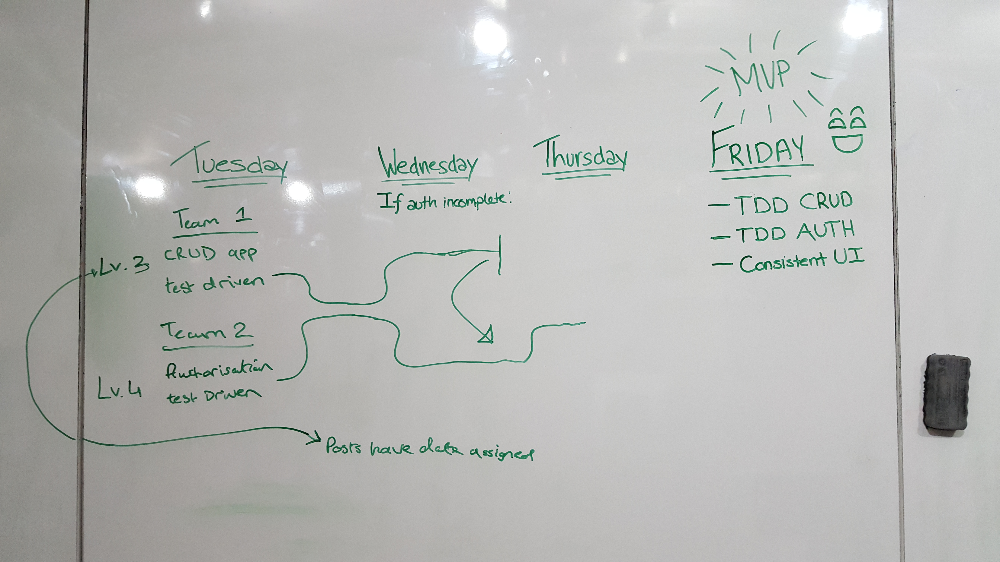

# Jaidbook

The purpose of this project was to create a facebook clone, designed in Ruby on Rails.

During the development cycle the team was able to produce a working CRUD application with many features shared by facebook such as the ability to post (with a picture) to the homepage, post other users walls and many more such as liking posts and commenting on them. We did this all while being able to sign-in and out successfully using devise.

We used many industry standard practices to achieve this in a 2 week period, such as daily stand-ups and evening retros while adhering to agile methodologies and incorporating XP values. Additionally we divided the work using a Trello board (link can be found below) and we followed a user story driven model which can also be found below so please have a read.

## Build Status
[](https://travis-ci.org/AsadK47/Jaidbook)


## Links to the application and development board

**Heroku application:** https://jaidbook.herokuapp.com/

**Trello board:** https://trello.com/b/Fp0JIOMP/acebook-planning-team-jaid

**Engineering project outline:** https://github.com/makersacademy/course/tree/master/engineering_projects/rails

## Members
- [Asad Khan](https://github.com/AsadK47)
- [Darryl Banks](https://github.com/zombie9)
- [Ijeoma Nelson](https://github.com/githubsttar)
- [Jackie Dunne](https://github.com/kiedunne)

## Local installation instructions

```
clone repo
cd into Jaidbook
bundle install
createdb pg_jaid_dev
createdb pg_jaid_test
rake db:schema:load
```
**Testing Instructions**

```
bundle exec rspec # Run the tests to ensure it works
bin/rails server # Start the server at localhost:3000
```

## User Stories

```
As a user,
So that I can have a unique account,
I would like to be able to sign-up.

As a user,
So that I can access my unique account,
I would like to be able to sign-in.

As a user,
So that I can have a unique account,
I would like to be able to edit my profile picture.

As a user,
So that I can socialise,
I would like to be able to create posts.

As a user,
So that I can make my posts more interesting,
I would like to be able to add pictures to my posts.

As a user,
So that I can interact with other posts,
I would like to be able to comment on a post.

As a user,
So that I can interact with other posts,
I would like to be able to like a post.

As a user,
So that I can socialise with others,
I would like to be able to add friends.

As a user,
So that I can socialise with my friends,
I would like to be able to post on another users wall.
```

## Contributing to the project

If you wish to contribute to the project then please do so by running the code through the rspec tests and the rubocop linter.

We are open to pull requests and would definitely appreciate any comments and feedback that you may have about the project.

Please ensure that the pull request is descriptive and easy to understand so as to minimize the time between the request and merge.

## Deploying to Heroku

**Please follow the instructions set below:**

1. Create an account on Heroku
2. Install the Heroku command line tools by running the following from the command line ```brew install heroku/brew/heroku```
3. Create the heroku application, either on Heroku(https://id.heroku.com/login) or running the following from the command line ```heroku create app-name```
4. Push the app to Heroku via the command line using ```git push heroku master```
5. Create the app database on Heroku via the command line using ```heroku run rake db:migrate```
6. Open the app on Heroku via the command line using ```heroku open```
7. You may need to login via the Heroku command line interface (CLI) at any point: ```heroku login```
8. On the Heroku website, go to your app console and take a look at the deploy options.

**From there, you can connect to GitHub via the Heroku integration. Select the option to automatically deploy the app to Heroku only when the CI build passes.**

## Documentation

Below are some diagrams which we drew up in the initial stages of the application during our daily standup. It helped us to create a basic outline of the project and we used it as a guide to get us up and running.

Furthermore we had created a wiki page to help us document our work (link found below) which would in the show how much we had learned and accomplished throughout the project.

Wiki pages: https://github.com/AsadK47/Jaidbook/wiki

### Diagrams

**Diagram of the basic features during the first sprint**



**Diagram of the basic class layouts and how the interaction between classes might work**



**Goals we created that we wanted for the first 2 sprints and what we would need for our minimum viable product**


